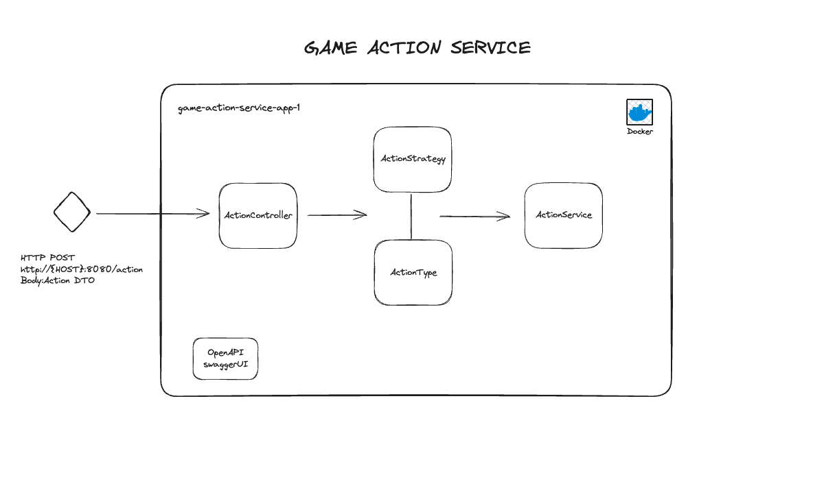

# Game Action Service Application

---
### Overall Architecture


### How does the application works?
* Application receives the requests via `/action` url with `Action` DTO.
* On the swagger page you can find the relevant api endpoint.
* You can reach the openapi page by `http://localhost:8080/swagger-ui/index.html` url.

## Technologies

---
- Java 8
- Spring Boot 2.7
- Open API 1.6
- Lombok
- Maven
- Docker
- Docker Compose


## Prerequisites

---
- Maven
- Docker
---

## Docker Run
The application can be built and run by the `Docker` engine. The `Dockerfile` has multistage build, so you do not need to build and run separately.

Please follow the below directions in order to build and run the application with Docker Compose;

```sh
$ cd game-action-service
$ docker-compose up -d
```

Docker compose creates an instance of the application on port 8080.